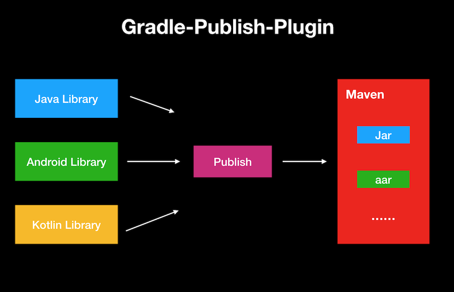

### Gradle Publish Plugin

A flex gradle plugin for publish your library to maven repository become easy.



### Feature
- support publish multi-library, such as Java、Android、Kotlin
- support for api / implementation dependencies in new Gradle
- supports also @aar and transitive: false.
- generate Kotlin doc with [dokka](https://github.com/Kotlin/dokka)
- support upload sources Jar (configurable, default true)
- sign a library including sources, Javadoc, and a customized POM (configurable, default false, and require Gradle Version >= 4.8)

### Usage

for Gradle version >= 2.1:

        plugins {
          id "com.whl.gradle-publish-plugin" version "0.1.16-SNAPSHOT"
        }


for Gradle version < 2.1 or where dynamic configuration is required:

        buildscript {
          repositories {
            maven {
              url "https://plugins.gradle.org/m2/"
            }
          }
          dependencies {
            classpath "com.whl:gradle-publish-plugin:0.1.16-SNAPSHOT"
          }
        }

        apply plugin: "com.whl.gradle-publish-plugin"

> "com.whl.gradle-publish-publish" should be after apply "java-library" or "com.android.library"

then, configuration in your build.gradle，such as:

simple example:

        group 'com.example'
        version '1.0-SNAPSHOT'

        gradlePublish {

            releaseRepository {
                url = "http://your repository.com/nexus/content/repositories/releases"
                userName = "your release account"
                password = "your release account"
            }

        }

complete example:

        group 'com.example'
        version '1.0-SNAPSHOT'

        gradlePublish {

            sourceJarEnabled = true
            javaDocEnabled = true
            signEnabled = false

            releaseRepository {
                url = "http://your repository.com/nexus/content/repositories/releases"
                userName = "your release account"
                password = "your release account"
            }

            snapshotRepository {
                url = "http://your repository.com/nexus/content/repositories/snapshots"
                userName = "your snapshot account"
                password = "your snapshot account"
            }

        }


last, execute `./gradlew publish` task to publish your library to specified maven repository


### License
```
Copyright 2019 Jack Wang

Licensed under the Apache License, Version 2.0 (the "License");
you may not use this file except in compliance with the License.
You may obtain a copy of the License at

   http://www.apache.org/licenses/LICENSE-2.0

Unless required by applicable law or agreed to in writing, software
distributed under the License is distributed on an "AS IS" BASIS,
WITHOUT WARRANTIES OR CONDITIONS OF ANY KIND, either express or implied.
See the License for the specific language governing permissions and
limitations under the License.
```